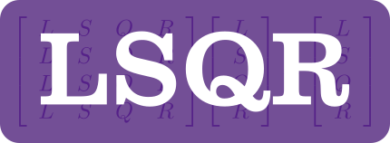

============


### Brief Description

A Fortran 2008 edition of LSQR, a conjugate-gradient type method for solving sparse linear equations and sparse least-squares problems.

LSQR can solve linear systems of the form: `A * x = b` or `[A; damp*I]*x = [b; 0]`. Where `A` is a matrix with `m` rows and `n` columns, `b` is an `m`-vector, and `damp` is a scalar. The matrix `A` is intended to be large and sparse, and may be square or rectangular (over-determined or under-determined).

### Usage

There are two classes in the library that can be used, `lsqr_solver` (which is more low-level) and `lsqr_solver_ez` (which has a simpler interface).

To use the `lsqr_solver_ez` class, you have to provide the matrix `A` in sparse form, using three arrays: the row indices, column indices, and the nonzero elements.  Here is an example:

```fortran
program main

 use lsqr_kinds
 use lsqr_module, only: lsqr_solver_ez

 implicit none

 ! define a 3x3 dense system to solve:
 integer,parameter :: m = 3 !! number of rows in `A` matrix
 integer,parameter :: n = 3 !! number of columns in `A` matrix
 real(wp),dimension(m),parameter :: b = real([1,2,3],wp)  !! RHS vector
 integer,dimension(m*n),parameter :: icol = [1,1,1,2,2,2,3,3,3] !! col indices of nonzero elements of `A`
 integer,dimension(m*n),parameter :: irow = [1,2,3,1,2,3,1,2,3] !! row indices of nonzero elements of `A`
 real(wp),dimension(m*n),parameter :: a = real([1,4,7,2,5,88,3,66,9],wp)  !! nonzero elements of `A`

 type(lsqr_solver_ez) :: solver  !! main solver class
 real(wp),dimension(n) :: x   !! solution to `A*x = b`
 integer :: istop  !! solver exit code

 call solver%initialize(m,n,a,irow,icol) ! use defaults for other optional inputs
 call solver%solve(b,zero,x,istop)       ! solve the linear system

 write(*,*) 'istop = ', istop
 write(*,'(1P,A,*(E16.6))') 'x = ', x

end program main
```

The result from this example is:

```
 istop = 1
 x = 1.242424E+00   -6.060606E-02   -4.040404E-02
```

### Compiling

A [Fortran Package Manager](https://github.com/fortran-lang/fpm) manifest file is included, so that the library and test cases can be compiled with FPM. For example:

```
fpm build --profile release
fpm test --profile release
```

To use `lsqr` within your fpm project, add the following to your `fpm.toml` file:
```toml
[dependencies]
lsqr = { git="https://github.com/jacobwilliams/lsqr.git" }
```

### Documentation

The latest API documentation can be found [here](http://jacobwilliams.github.io/LSQR/). This was generated from the source code using [FORD](https://github.com/Fortran-FOSS-Programmers/ford).

### License

The lsqr source code and related files and documentation are distributed under a permissive free software [license](https://github.com/jacobwilliams/LSQR/blob/master/LICENSE.txt) (BSD-style).

### References

* The original Fortran 77 version of this algorithm can be found here: [https://web.stanford.edu/group/SOL/software/lsqr/](https://web.stanford.edu/group/SOL/software/lsqr/) The updated version has been significantly refactored.
* C.C. Paige and M.A. Saunders,  [LSQR: An algorithm for sparse linear equations and sparse least squares](https://stanford.edu/group/SOL/software/lsqr/lsqr-toms82a.pdf), ACM Transactions on Mathematical Software 8, 1 (March 1982), pp. 43-71.
* C.C. Paige and M.A. Saunders,  [Algorithm 583, LSQR: Sparse linear equations and least-squares problems](https://web.stanford.edu/group/SOL/software/lsqr/lsqr-toms82b.pdf), ACM Transactions on Mathematical Software 8, 2 (June 1982), pp. 195-209.
* C.L. Lawson, R.J. Hanson, D.R. Kincaid and F.T. Krogh, [Basic linear algebra subprograms for Fortran usage](https://dl.acm.org/citation.cfm?id=355847), ACM Transactions on Mathematical Software 5, 3 (Sept 1979), pp. 308-323 and 324-325.